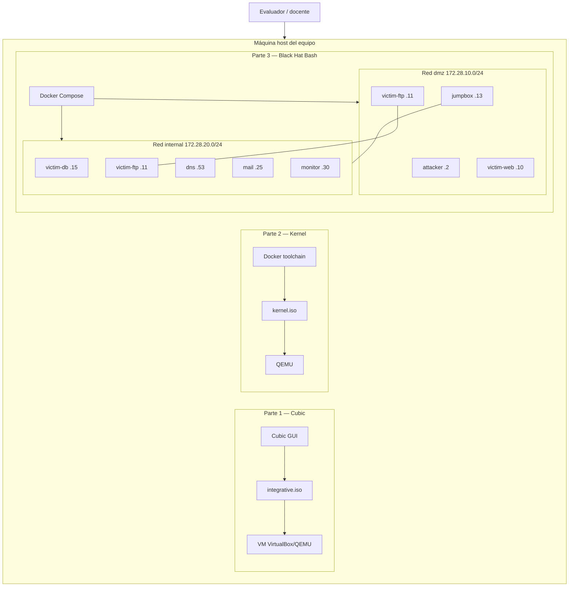
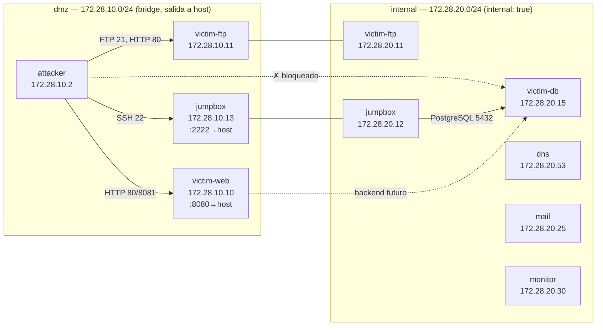
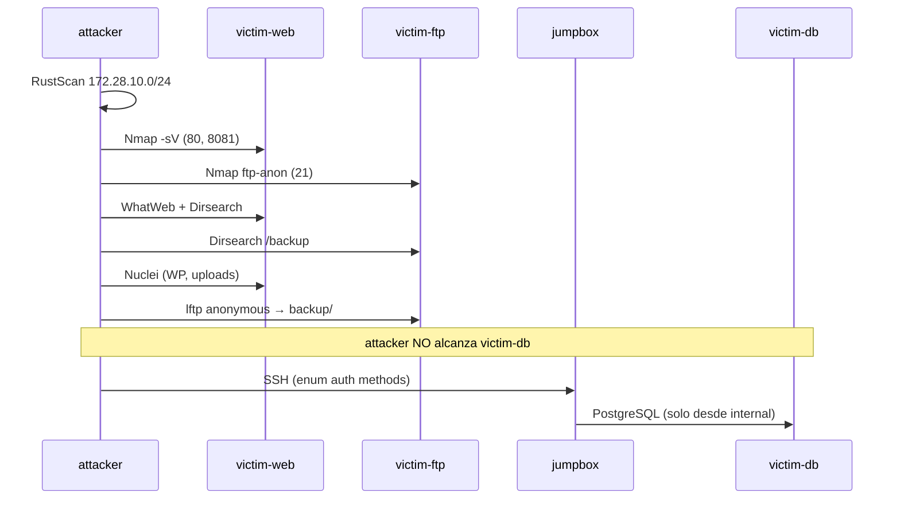
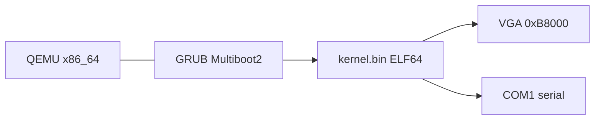

# Diagrama de redes

Documentación de topología de red del laboratorio ofensivo (Parte 3) y visión
de cómo se despliegan las partes del proyecto en el entorno del evaluador.

---

## 1. Visión global del proyecto (entorno del evaluador)



---

## 2. Topología Docker — Parte 3 (detalle)

### Diagrama lógico



### Diagrama ASCII (referencia rápida)

```
                    ┌─────────────────────────────────────────┐
                    │           HOST (puertos publicados)      │
                    │   localhost:8080 ──► victim-web:80     │
                    │   localhost:2222 ──► jumpbox:22        │
                    └─────────────────────────────────────────┘
                                        │
        ┌───────────────────────────────┴───────────────────────────────┐
        │                    RED dmz — 172.28.10.0/24                    │
        │  .2 attacker    .10 victim-web    .11 victim-ftp    .13 jumpbox │
        └───────────────────────────────┬───────────────────────────────┘
                                        │ (dual-homed: ftp, jumpbox)
        ┌───────────────────────────────┴───────────────────────────────┐
        │              RED internal — 172.28.20.0/24 (aislada)         │
        │  .11 ftp   .12 jumpbox   .15 db   .53 dns   .25 mail  .30 mon │
        └───────────────────────────────────────────────────────────────┘

Leyenda:
  attacker ──► victim-web, victim-ftp, jumpbox     (dmz)
  attacker ──X victim-db                           (sin ruta a internal)
  jumpbox  ──► victim-db                           (pivot legítimo de lab)
```

---

## 3. Matriz de conectividad

| Origen | Destino | Red | Puerto | Permitido | Notas |
|--------|---------|-----|--------|-----------|-------|
| attacker | victim-web | dmz | 80, 8081 | Sí | Superficie web principal |
| attacker | victim-ftp | dmz | 21, 80 | Sí | FTP anónimo + Apache backup |
| attacker | jumpbox | dmz | 22 | Sí | Bastión SSH |
| attacker | victim-db | internal | 5432 | **No** | Segmentación verificada |
| attacker | dns, mail, monitor | internal | varios | **No** | Red internal sin gateway desde dmz |
| jumpbox | victim-db | internal | 5432 | Sí | Doble interfaz dmz+internal |
| victim-web | victim-db | internal | 5432 | Sí* | Backend simulado (*futuro) |
| host | victim-web | NAT | 8080→80 | Sí | Acceso desde navegador local |
| host | jumpbox | NAT | 2222→22 | Sí | SSH al bastión |

Verificación automatizada: `parte3-black-hat-bash/network/verify-network.sh`

---

## 4. Flujo del ataque documentado



---

## 5. Parte 2 — Kernel (sin red)

El kernel no implementa stack de red en esta entrega. La “red” relevante es la
interfaz serial QEMU (`-serial stdio`) y el buffer VGA en `0xB8000`.



---

## 6. Parte 1 — Red en la ISO

La ISO personalizada es un sistema de escritorio estándar; no define topología
de laboratorio. Requisitos de red para el build:

| Fase | Red | Uso |
|------|-----|-----|
| Chroot Cubic | Internet | APT: LibreWolf, VS Code, neovim |
| VM post-install | NAT/bridge | Verificación de boot y paquetes |

---

## Referencias

- [parte3-black-hat-bash/network/topology.md](../parte3-black-hat-bash/network/topology.md)
- [parte3-black-hat-bash/docker-compose.yml](../parte3-black-hat-bash/docker-compose.yml)
- [docs/arquitectura-laboratorio.md](arquitectura-laboratorio.md)
