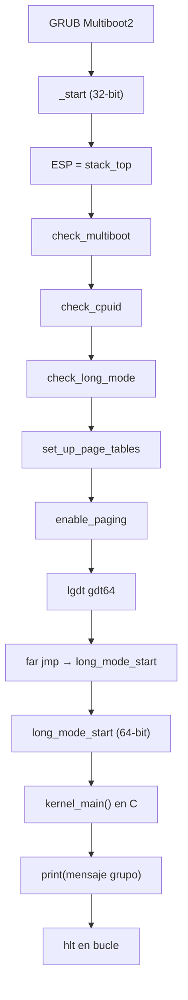

# Episode 2 — Long Mode, paginación y kernel en C

Implementación basada en el tutorial [*Write Your Own 64-bit Operating System*](https://os.phil-opp.com/entering-longmode/) (phil-opp) y la serie en video homónima.

## Objetivo

Salir del modo protegido de 32 bits que deja GRUB, verificar el hardware, activar paginación con huge pages de 2 MiB, cargar una GDT de 64 bits, entrar en **long mode** y ejecutar `kernel_main()` en C con una función `print()` y un mensaje personalizado del grupo.

---

## Mapa de archivos

| Archivo | Rol |
|---------|-----|
| `src/boot/header.asm` | Cabecera **Multiboot2** (magic, arquitectura i386, checksum, end tag). GRUB la valida antes de saltar a `_start`. |
| `src/boot/main.asm` | **`_start` en 32 bits**: stack, verificaciones, paging, `lgdt`, far jump a long mode. |
| `src/boot/main_ep1.asm` | Arranque mínimo Episode 1 (`OK` en VGA). Solo se usa con `make episode1`. |
| `src/arch/gdt.asm` | **GDT de 64 bits**: descriptor nulo + segmento de código ejecutable. Incluye estructura `gdt64.pointer` para `lgdt`. |
| `src/arch/paging.asm` | Tablas **PML4 / PDPT / PD** en `.bss` (4 KiB alineadas). Mapa identidad del primer **GiB** con 512 páginas de **2 MiB**. |
| `src/arch/long_mode.asm` | **`long_mode_start` en 64 bits**: limpia selectores de datos y llama a `kernel_main`. |
| `src/kernel/main.c` | **`kernel_main()`**: mensaje del grupo y bucle `hlt`. |
| `src/kernel/vga.h` | API de consola VGA (`print`, `clear_screen`, constantes). |
| `src/kernel/vga.c` | Implementación de **`print()`** sobre el buffer texto `0xB8000` (80×25). |
| `linker.ld` | Carga el kernel en **1 MiB**; orden de secciones Multiboot → text → rodata → data → bss. |
| `grub.cfg` | Entrada `multiboot2 /boot/kernel.bin`. |
| `Makefile` | `episode1` (elf32) y `episode2` (elf64 + GCC freestanding). |

---

## Explicación por archivo

### `header.asm`

GRUB exige una estructura alineada a 8 bytes al inicio del ejecutable:

- `0xE85250D6` — magic Multiboot2.
- `0` — arquitectura i386 (arranque en modo protegido 32 bits).
- Longitud y **checksum** (suma de los tres primeros `dd` = 0 mod 2³²).
- Tag de fin (type 0, size 8).

Sin esto, GRUB no carga el kernel.

### `main.asm` (Episode 2)

1. **`mov esp, stack_top`** — 16 KiB de stack en `.bss` (necesario para `call`).
2. **`check_multiboot`** — `EAX` debe ser `0x36D76289` (magic que escribe GRUB).
3. **`check_cpuid`** — prueba el bit ID en EFLAGS (bit 21).
4. **`check_long_mode`** — `CPUID` hoja `0x80000001`, bit LM (29) en EDX.
5. **`set_up_page_tables`** / **`enable_paging`** — ver `paging.asm`.
6. **`lgdt [gdt64.pointer]`** — carga la GDT de 64 bits.
7. **`jmp gdt64.code:long_mode_start`** — far jump: recarga CS y entra en modo 64-bit real.

Si alguna verificación falla, **`error`** escribe `ERR: X` en VGA (fondo rojo) y hace `hlt`.

### `gdt.asm`

En long mode la segmentación casi no se usa, pero hace falta un descriptor de **código 64-bit** para el far jump:

| Bits | Significado |
|------|-------------|
| 43 | Ejecutable |
| 44 | Tipo código/datos |
| 47 | Presente |
| 53 | Segmento 64-bit |

`gdt64.code` es el offset (8) del segmento de código respecto al inicio de la GDT.

### `paging.asm`

Jerarquía de 4 niveles (PML4 → PDPT → PD). Para el primer GiB usamos **huge pages** en el nivel PD (bit PS = 1):

- 512 entradas × 2 MiB = **1 GiB** mapeado identidad (VA = PA).
- Flags por entrada: **Present** + **Writable** + **Huge**.

`enable_paging`:

1. `CR3 ← p4_table`
2. `CR4.PAE ← 1`
3. `EFER.LME ← 1` (MSR `0xC0000080`)
4. `CR0.PG ← 1`

Tras esto la CPU está en **compatibility mode** (long mode con código 32-bit); el far jump activa el modo 64-bit completo.

### `long_mode.asm`

- `bits 64` — solo instrucciones de 64 bits.
- Anula SS, DS, ES, FS, GS (buena práctica antes de usar IRQs más adelante).
- `call kernel_main` — enlace con C.

### `vga.c` / `vga.h`

- Buffer en `0xB8000`: cada celda = carácter + atributo de color.
- `print()` recorre la cadena, respeta `\n` y hace scroll al llegar a la fila 25.
- `clear_screen()` rellena espacios y reinicia cursor.

### `main.c`

Define las macros `GROUP_BANNER_LINE*` con el **mensaje personalizado del grupo**. Edita los nombres del equipo antes de grabar el video o entregar.

---

## Flujo de arranque



**Cadena de build (Episode 2):**

```
header.asm + main.asm + gdt.asm + paging.asm + long_mode.asm
    → nasm -f elf64 → build/ep2/*.o
main.c + vga.c → gcc -m64 -ffreestanding → build/ep2/*.o
    → ld -T linker.ld → kernel-ep2.elf
    → objcopy → kernel.bin → grub-mkrescue → kernel.iso → QEMU
```

---

## Cómo probar cada etapa

### Requisitos

```bash
cd parte2-kernel-x86_64
make docker-build    # una vez
make docker-episode2
make docker-run
```

En el host (con NASM, GCC, GRUB, QEMU):

```bash
make episode2
make run
```

### Episode 1 (regresión)

```bash
make episode1 && make run
```

Debe aparecer **`OK`** en la esquina superior izquierda (gris sobre negro).

### Episode 2 (completo)

```bash
make episode2 && make run
```

Debe aparecer el **banner del grupo** (varias líneas centradas a la izquierda).

### Pruebas de verificación (errores esperados)

Modifica temporalmente `main.asm`, recompila y observa VGA:

| Prueba | Cambio | Pantalla esperada |
|--------|--------|-------------------|
| Multiboot | En `check_multiboot`, comparar con `0` en vez del magic | `ERR: 0` (rojo) |
| CPUID | Comentar `xor eax, 1 << 21` en `check_cpuid` | `ERR: 1` |
| Long mode | Forzar `test edx, 0` en `check_long_mode` | `ERR: 2` |

Restaura el código después de cada captura.

### Punto intermedio (solo ASM, sin C)

En `long_mode.asm`, antes de `call kernel_main`, añade temporalmente:

```nasm
mov rax, 0x2f592f412f4b2f4f    ; "OKAY" en VGA
mov qword [0xb8000], rax
```

Si ves **OKAY**, la transición a long mode funciona. Quita esas líneas para la versión final con C.

### Verificación del ELF

```bash
readelf -h build/kernel-ep2.elf
objdump -d build/kernel-ep2.elf | less
```

---

## Capturas para el video y README

Guarda las imágenes en `docs/evidencias/parte2/` con nombres descriptivos.

| # | Captura | Para qué sirve |
|---|---------|----------------|
| 1 | Terminal: `make docker-episode2` (o `make episode2`) sin errores | README — build reproducible |
| 2 | QEMU Episode 1 con **OK** | Comparar progreso Ep1 → Ep2 |
| 3 | QEMU Episode 2 con **banner del grupo** | Evidencia principal Parte 2 |
| 4 | `ERR: 0` (multiboot fallido) | Video — verificación Multiboot |
| 5 | `ERR: 1` (CPUID) | Video — verificación CPUID |
| 6 | `ERR: 2` (long mode) | Video — verificación long mode |
| 7 | (Opcional) **OKAY** en prueba intermedia ASM | Video — transición long mode |
| 8 | `readelf -h build/kernel-ep2.elf` mostrando ELF64 | README técnico |
| 9 | Árbol `src/` o diff del commit Episode 2 | README — estructura del código |

### Guion sugerido para el video (2–4 min)

1. Mostrar estructura de archivos (`src/boot`, `src/arch`, `src/kernel`).
2. Explicar en una diapositiva o pizarra: Multiboot → checks → paging 2 MiB → GDT → far jump → C.
3. `make episode2` en terminal.
4. QEMU con mensaje del grupo.
5. (Opcional) Una captura de error `ERR: X` para demostrar las verificaciones.
6. Mencionar personalización del mensaje en `main.c`.

### Texto sugerido para README (Parte 2)

```markdown
## Episode 2 — Resultado

- Verificaciones: Multiboot2, CPUID, Long Mode
- Paginación identidad 1 GiB (huge pages 2 MiB)
- GDT 64-bit + transición a long mode
- `kernel_main()` en C con `print()` VGA


```

---

## Personalizar el mensaje del grupo

Edita en `src/kernel/main.c`:

```c
#define GROUP_BANNER_LINE3 "  Equipo: Tu Nombre, Otro Nombre, ..."
```

Recompila con `make episode2`.

---

## Troubleshooting

| Síntoma | Causa probable |
|---------|----------------|
| Triple fault / reinicio QEMU | Checksum Multiboot incorrecto o far jump mal formado |
| Pantalla negra | `kernel_main` no alcanzado; revisar enlazado de `long_mode_start` |
| `ERR: 0` con GRUB | No arrancaste con `multiboot2` o magic incorrecto |
| Page fault tras paging | Tablas no alineadas a 4 KiB o flags huge incorrectos |
| Caracteres basura en C | Falta `-mno-red-zone` o stack no inicializado |
