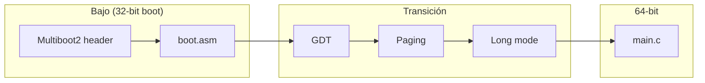

# Parte 2 — Kernel x86_64

**Puntos:** 30 · **Responsable:** [Nombre C]

Kernel mínimo x86_64 con Multiboot2, NASM, GRUB, QEMU y build reproducible
en Docker. Genera `kernel.iso` al finalizar.

## Arquitectura

```
GRUB (Multiboot2)
    → boot.asm / header.asm
    → Episode 1: imprimir "OK" (VGA o serial)
    → Episode 2: GDT + paging + long mode
    → main.c (kernel en C)
```

## Requisitos

- Docker 24+
- Make 4.3+
- (Opcional en host) QEMU para depuración fuera de Docker

## Comandos

```bash
make build       # Compila y genera kernel.iso
make run         # Ejecuta en QEMU
make episode1    # Build solo Episode 1
make episode2    # Build completo (long mode + C)
make clean       # Limpia artefactos
```

## Episodes

### Episode 1

- Header Multiboot2 válido
- Salida `OK` visible en QEMU (VGA texto o puerto serial)

### Episode 2

- GDT configurada para modo 64 bits
- Paging (identidad map o esquema documentado)
- Transición a long mode
- Llamada a `main()` en C

## Diagrama de memoria



## Estructura

```
parte2-kernel-x86_64/
├── README.md
├── Dockerfile
├── Makefile
├── linker.ld
├── grub.cfg
├── src/
│   ├── boot/
│   ├── arch/
│   └── kernel/
├── scripts/
└── output/          # kernel.iso, objetos (NO en Git)
```

## Evidencias

Capturas y logs en [docs/evidencias/parte2/](../docs/evidencias/parte2/).

## Troubleshooting

| Síntoma | Posible causa |
|---------|---------------|
| Triple fault | GDT o paging incorrectos |
| GRUB: no multiboot | Header Multiboot2 mal alineado |
| Pantalla negra | VGA no inicializada; probar serial |
