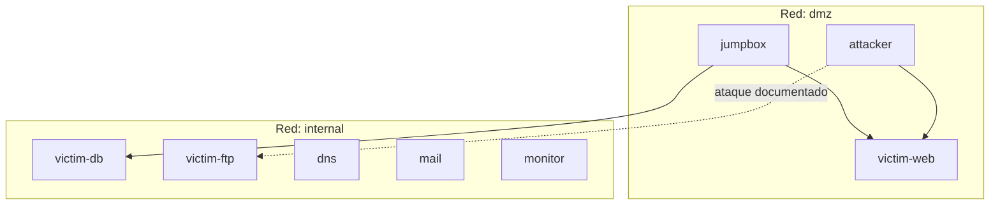

# Parte 3 — Black Hat Bash

**Puntos:** 35 · **Responsable:** [Nombre D]

Laboratorio ofensivo con Docker Compose: 8 contenedores, segmentación de red,
`make deploy`, `make test` y una técnica ofensiva documentada.

> **Aviso ético:** Solo ejecutar en este entorno aislado. Sin objetivos reales
> ni redes externas no autorizadas.

## Topología



## Servicios (8 contenedores)

| Contenedor | Rol | Red | Puerto host |
|------------|-----|-----|-------------|
| attacker | Herramientas ofensivas | dmz (+ internal si aplica) | — |
| victim-web | Web vulnerable | dmz | 8080 |
| victim-db | Base de datos | internal | — |
| victim-ftp | FTP con credenciales débiles | internal | — |
| dns | Resolución interna | internal | — |
| mail | SMTP relay | internal | — |
| monitor | Captura / logs | internal | — |
| jumpbox | Bastión SSH | dmz + internal | 2222 |

## Comandos

```bash
cp .env.example .env
make deploy    # docker compose up -d
make test      # contenedores + redes + técnica ofensiva
make logs      # logs agregados
make down      # detener y limpiar
```

## Verificación de redes

Script: [network/verify-network.sh](network/verify-network.sh)

Documentar qué puede comunicarse con qué en [network/topology.md](network/topology.md).

## Técnica ofensiva

Documentada en [offensive/tecnica.md](offensive/tecnica.md).

**Playbook automatizado (15/15 hacking):**

```bash
make deploy
make test                              # incluye playbook ofensivo
# o solo la fase ofensiva:
docker compose exec attacker bash /lab/offensive/exploit.sh
```

Herramientas: RustScan → Nmap → WhatWeb → Dirsearch → Nuclei → FTP anónimo.

Evidencias en `offensive/evidencia/` y [docs/evidencias/parte3/](../docs/evidencias/parte3/).

Flujo: reconocimiento → enumeración → vulnerabilidades → acceso FTP → mitigación.

## Estructura

```
parte3-black-hat-bash/
├── README.md
├── Dockerfile
├── docker-compose.yml
├── Makefile
├── .env.example
├── services/       # 8 servicios
├── network/
├── offensive/
└── tests/
```

## Evidencias

[docs/evidencias/parte3/](../docs/evidencias/parte3/) — salida de `make test`, capturas del ataque.
